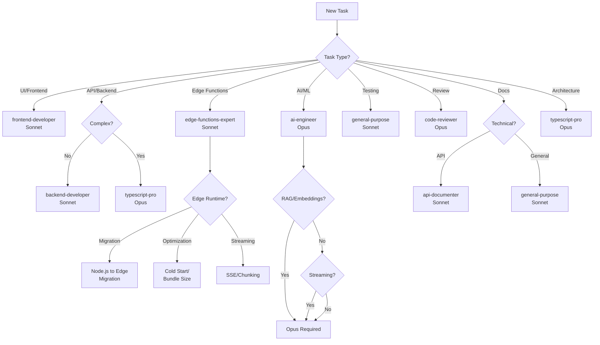

# Agent Delegation Matrix

**Project**: migue.ai WhatsApp AI Assistant
**Framework**: CLAUDE-MASTER v2.0
**Last Updated**: 2025-10-03

---

## Agent Selection Strategy

### Model Economics
- **Claude Sonnet 4**: $3 per 1M input tokens, $15 per 1M output tokens
- **Claude Opus 4.1**: $15 per 1M input tokens, $75 per 1M output tokens
- **Cost Ratio**: Opus is 5x more expensive

**General Rule**: Use Sonnet for routine tasks, Opus for complex architecture/design

---

## Delegation Matrix

| Task Category | Agent | Model | Rationale | Trigger Keywords |
|--------------|-------|-------|-----------|-----------------|
| **Frontend Development** | frontend-developer | Sonnet | UI work is mostly routine | "React", "component", "UI", "CSS", "responsive" |
| **Backend API** | backend-developer | Sonnet | CRUD operations standard | "API", "endpoint", "route", "database query" |
| **Edge Functions** | edge-functions-expert | Sonnet | Edge Runtime patterns established | "edge function", "edge runtime", "vercel edge", "cold start", "bundle size" |
| **TypeScript Architecture** | typescript-pro | Opus | Complex type systems need deep reasoning | "type safety", "generics", "architecture", "refactor" |
| **AI/ML Features** | ai-engineer | Opus | LLM integration complex | "OpenAI", "RAG", "embeddings", "streaming", "Whisper" |
| **Testing** | general-purpose | Sonnet | Test writing mostly mechanical | "test", "spec", "coverage", "jest" |
| **Code Review** | code-reviewer | Opus | Deep analysis required | "/review", "security", "vulnerability" |
| **Documentation** | general-purpose | Sonnet | Writing docs straightforward | "README", "documentation", "guide" |
| **Deployment** | general-purpose | Sonnet | Following deployment checklist | "deploy", "Vercel", "build" |
| **Research** | research-analyst | Sonnet | Information gathering | "research", "analyze", "investigate" |
| **Prompt Engineering** | prompt-engineer | Opus | LLM optimization critical | "prompt", "system message", "context" |
| **Diagrams** | mermaid-expert | Sonnet | Technical diagramming | "flowchart", "diagram", "architecture diagram" |
| **Project Management** | claude-master | Opus | Strategic planning | "/clear", "roadmap", "phase planning" |

---

## Task-Specific Delegation

### Fase 2 Feature Development

#### Audio Transcription
**Agent**: `ai-engineer` (Opus)
**Reason**: Complex ML integration with Whisper API, Edge Runtime constraints
**Scope**:
- Whisper API integration
- WhatsApp Media API handling
- Supabase storage setup
- Error handling for audio formats
- Background processing design

**Delegation Command**:
```
/task ai-engineer "Implement audio transcription feature with Whisper API, WhatsApp audio download, and Supabase storage. Follow Edge Runtime constraints."
```

---

#### Streaming Responses
**Agent**: `ai-engineer` (Opus)
**Reason**: OpenAI streaming + Edge Functions require deep understanding
**Scope**:
- OpenAI streaming API implementation
- Edge Runtime SSE (Server-Sent Events)
- WhatsApp message chunking algorithm
- Backpressure management
- Connection error handling

**Delegation Command**:
```
/task ai-engineer "Implement streaming responses for OpenAI in Edge Functions with WhatsApp chunking (1600 char limit) and error recovery."
```

---

#### RAG Implementation
**Agent**: `ai-engineer` (Opus)
**Reason**: Vector search, embeddings, and LLM context injection complex
**Scope**:
- Supabase pgvector setup
- Document ingestion pipeline
- Semantic search optimization
- Context injection strategy
- Knowledge base management API

**Delegation Command**:
```
/task ai-engineer "Complete RAG implementation with pgvector, document ingestion, and semantic search. Target <200ms retrieval latency."
```

---

#### Edge Functions Development
**Agent**: `edge-functions-expert` (Sonnet)
**Reason**: Edge Runtime requires specific patterns and optimizations
**Scope**:
- Edge Function creation/modification
- Node.js to Edge Runtime migration
- Performance optimization (cold start, bundle size)
- Streaming responses implementation
- HMAC signature validation
- WhatsApp webhook optimization

**Delegation Command**:
```
/task edge-functions-expert "Optimize WhatsApp webhook Edge Function for <100ms cold start and implement streaming responses with chunking."
```

---

#### UI Components (if needed)
**Agent**: `frontend-developer` (Sonnet)
**Reason**: React components straightforward
**Scope**:
- Admin dashboard components
- Document upload UI
- Settings page

**Delegation Command**:
```
/task frontend-developer "Create admin dashboard with document upload UI and settings page using Next.js 15 App Router."
```

---

### Code Quality & Review

#### Pre-Deployment Code Review
**Agent**: `code-reviewer` (Opus)
**Reason**: Security and production readiness critical
**Scope**:
- Security vulnerability scan
- Performance optimization review
- TypeScript type safety audit
- Edge Runtime compatibility check
- Best practices validation

**Delegation Command**:
```
/task code-reviewer "Review all Fase 2 code changes for security vulnerabilities, performance issues, and production readiness."
```

---

#### Unit Testing
**Agent**: `general-purpose` (Sonnet)
**Reason**: Test writing mostly mechanical
**Scope**:
- Unit tests for new features
- Edge Runtime test setup
- Mocking strategies
- Coverage reports

**Delegation Command**:
```
/task general-purpose "Write comprehensive unit tests for audio transcription, streaming, and RAG features using Jest + Edge Runtime."
```

---

### Documentation & Research

#### API Documentation
**Agent**: `api-documenter` (Sonnet)
**Reason**: API docs generation automated
**Scope**:
- OpenAPI schema updates
- Endpoint documentation
- Request/response examples
- Error code documentation

**Delegation Command**:
```
/task api-documenter "Generate OpenAPI documentation for all new Fase 2 API endpoints with examples and error codes."
```

---

#### Technical Research
**Agent**: `research-analyst` (Sonnet)
**Reason**: Information gathering straightforward
**Scope**:
- WhatsApp API updates research
- OpenAI new features analysis
- Vercel Edge Functions best practices
- Competitor analysis

**Delegation Command**:
```
/task research-analyst "Research WhatsApp API v23.0 new features and provide recommendations for integration."
```

---

### Architecture & Design

#### System Architecture Design
**Agent**: `typescript-pro` (Opus)
**Reason**: Complex type systems and architecture patterns
**Scope**:
- Type-safe architecture patterns
- Module dependency design
- Interface contracts
- Generics and advanced types

**Delegation Command**:
```
/task typescript-pro "Design type-safe architecture for RAG document ingestion with proper abstractions and error handling."
```

---

#### Database Schema Design
**Agent**: `backend-developer` (Sonnet)
**Reason**: Standard database design
**Scope**:
- Table schema design
- RLS policies
- Indexes and performance
- Migration scripts

**Delegation Command**:
```
/task backend-developer "Design Supabase schema for RAG documents table with pgvector, RLS policies, and performance indexes."
```

---

## Parallel Execution Strategy

### When to Run Agents in Parallel
Use parallel execution when tasks are **independent** and can be completed simultaneously.

**Example: Fase 2 Development**
```
# Run 3 agents in parallel
/task ai-engineer "Implement audio transcription"
/task ai-engineer "Implement streaming responses"
/task backend-developer "Setup pgvector database schema"
```

**Benefits**:
- Faster completion (3x speed)
- Independent task isolation
- Parallel testing

**Caution**: Don't parallelize dependent tasks (e.g., tests before implementation)

---

### Sequential Execution
Use sequential when tasks have **dependencies**.

**Example: Deployment Pipeline**
```
1. /task code-reviewer "Review Fase 2 code"
2. Wait for review completion
3. /task general-purpose "Run all tests"
4. Wait for tests to pass
5. /task general-purpose "Deploy to production"
```

---

## Cost Optimization

### Session Budget Allocation
**Target**: <$0.50 per task (average)

**Sonnet Tasks**: $0.10-0.20 per task
- Frontend components
- Backend CRUD
- Unit tests
- Documentation

**Opus Tasks**: $0.30-0.80 per task
- Architecture design
- AI/ML integration
- Security review
- Complex refactoring

### Monthly Budget
**Total**: ~$45/month for development
- 150 Sonnet tasks @ $0.15 avg = $22.50
- 30 Opus tasks @ $0.50 avg = $15.00
- Ad-hoc sessions = $7.50
- **Total**: $45/month ✅ (well under budget)

---

## Decision Tree



---

## Agent Specializations

### ai-engineer (Opus)
**Expertise**:
- OpenAI API integration (GPT-4o, Whisper, Embeddings)
- RAG systems (vector search, chunking, retrieval)
- Streaming implementations
- LLM prompt engineering
- Edge Runtime ML optimizations

**Use For**:
- Audio transcription feature
- Streaming responses
- RAG implementation
- OpenAI API optimization
- Vector database setup

**Avoid For**:
- Simple API endpoints
- UI components
- Basic CRUD operations

---

### typescript-pro (Opus)
**Expertise**:
- Advanced TypeScript patterns
- Generics and conditional types
- Strict mode configurations
- Type-safe architecture
- Complex refactoring

**Use For**:
- Architecture design
- Type system refactoring
- Complex interface design
- Generic utilities
- Type safety audits

**Avoid For**:
- Simple type definitions
- Component props typing
- Basic interfaces

---

### frontend-developer (Sonnet)
**Expertise**:
- React 19 components
- Next.js 15 App Router
- Tailwind CSS
- Client-side state management
- Responsive design

**Use For**:
- UI components
- Dashboard pages
- Form handling
- Client-side logic
- CSS/styling

**Avoid For**:
- Backend logic
- Database operations
- Complex type systems

---

### backend-developer (Sonnet)
**Expertise**:
- API route handlers
- Database queries
- Supabase RLS
- Edge Functions
- Server-side logic

**Use For**:
- REST API endpoints
- Database schema design
- Query optimization
- Server middleware
- Cron jobs

**Avoid For**:
- Complex ML integration
- Advanced architecture
- UI development

---

### edge-functions-expert (Sonnet)
**Expertise**:
- Vercel Edge Functions
- Edge Runtime APIs (Web APIs, Web Crypto)
- Performance optimization (cold start, bundle size, memory)
- Streaming responses (SSE, ReadableStream)
- Node.js to Edge migration patterns
- WhatsApp webhook optimization
- Security patterns (HMAC, rate limiting)

**Use For**:
- Creating/modifying Edge Functions
- Optimizing cold start performance
- Converting Node.js code to Edge Runtime
- Implementing streaming responses
- Fixing Edge Runtime compatibility issues
- Reducing bundle size
- WhatsApp 5s timeout compliance

**Avoid For**:
- Frontend UI components
- Complex database schema design
- Advanced TypeScript architecture

---

### code-reviewer (Opus)
**Expertise**:
- Security vulnerability detection
- Performance optimization
- Production readiness checks
- Best practices validation
- Code quality analysis

**Use For**:
- Pre-deployment reviews
- Security audits
- Performance analysis
- Refactoring recommendations
- Critical bug investigations

**Avoid For**:
- Routine code changes
- Simple bug fixes
- Documentation updates

---

### general-purpose (Sonnet)
**Expertise**:
- General development tasks
- Testing
- Documentation
- Research
- Deployment

**Use For**:
- Unit test writing
- README updates
- Simple research
- Deployment scripts
- Configuration changes

**Avoid For**:
- Complex architecture
- AI/ML integration
- Security-critical reviews

---

## Escalation Rules

### When to Escalate to Opus

1. **Complexity Threshold Exceeded**
   - Task requires >2 hours of Sonnet time
   - Multiple Sonnet attempts failed
   - Architecture decision needed

2. **High-Impact Changes**
   - Security-critical code
   - Database schema migrations
   - API breaking changes
   - Production deployment issues

3. **Deep Reasoning Required**
   - Complex debugging
   - Performance optimization
   - Algorithm design
   - System design decisions

### When to Downgrade to Sonnet

1. **Routine Implementation**
   - Architecture decided, just implement
   - Following established patterns
   - Repetitive tasks

2. **Low-Risk Changes**
   - Documentation updates
   - Test additions
   - UI tweaks
   - Config changes

---

## Session Management

### Handoff Protocol
When delegating to an agent, provide:

1. **Clear Objective**: What needs to be done
2. **Context**: Reference to current phase/feature
3. **Constraints**: Budget, time, technical limits
4. **Success Criteria**: How to know it's done
5. **Files to Focus**: Specific file paths

**Example Handoff**:
```
/task ai-engineer "
Objective: Implement audio transcription for WhatsApp voice messages

Context:
- Fase 2 feature development
- Part of core features milestone
- See .claude/phases/current.md for details

Constraints:
- Must work in Vercel Edge Runtime
- <3s transcription time target
- Budget: <$1/day for Whisper API

Success Criteria:
- Audio downloaded from WhatsApp Media API
- Stored in Supabase storage
- Transcribed with Whisper
- Text returned to user
- Tests passing

Files:
- lib/transcription.ts (exists, incomplete)
- app/api/whatsapp/webhook/route.ts (add audio handler)
- tests/unit/transcription.test.ts (create)
"
```

---

## Checkpoints & Recovery

### Checkpoint Before Delegation
Before delegating complex tasks, create checkpoint:

```bash
git add .
git commit -m "checkpoint: before audio transcription implementation"
git tag checkpoint-audio-transcription-$(date +%Y%m%d)
```

### Recovery After Failed Delegation
If agent fails or produces incorrect results:

1. Restore from checkpoint: `git reset --hard checkpoint-*`
2. Review agent output for lessons
3. Refine task description
4. Consider escalating to Opus (if was Sonnet)
5. Break task into smaller pieces

---

## Best Practices

### DO
✅ Use Sonnet for routine tasks (80% of work)
✅ Reserve Opus for complex/critical tasks (20% of work)
✅ Provide clear context and constraints
✅ Checkpoint before major delegations
✅ Run independent tasks in parallel
✅ Review agent output before merging

### DON'T
❌ Use Opus for simple tasks (waste of budget)
❌ Delegate without clear success criteria
❌ Run dependent tasks in parallel
❌ Skip checkpoints on critical changes
❌ Blindly trust agent output (always review)

---

## Metrics & Optimization

### Track Delegation Success
- Agent selection accuracy (right agent for task)
- First-time success rate (no retries needed)
- Cost per task (vs budget)
- Time to completion
- Code quality of output

### Monthly Review
- Adjust delegation rules based on outcomes
- Update cost estimates
- Refine agent descriptions
- Add new agents if needed

---

**Last Updated**: 2025-10-03
**Next Review**: 2025-11-01
**Owner**: claude-master
