# Architecture Master

Version: `v1.0.0`
Status: `ACTIVE`
Updated: `2026-02-08`

Este documento es la fuente de verdad arquitectónica del sistema.

## 1) Principios inmutables
1. `LLM-first`: el modelo decide estrategia de respuesta por turno (texto, tools, clarificación).
2. `Backend-as-guardrail`: el backend valida, persiste, aplica policy y seguridad.
3. `Multimodelo/multimodal`: selección por capacidades, costo y latencia; sin dependencia de un proveedor único.
4. `Memoria persistente`: historial + memoria semántica + perfil estable para personalización real.
5. `Durabilidad`: cada evento debe ser trazable y re-procesable.

## 2) Vista de sistema

```mermaid
flowchart TD
  A[Meta WhatsApp] --> B[/api/whatsapp/webhook]
  B --> C[Validate + ACK 200]
  C --> D[Persist normalized input]
  D --> E[Agent Context Builder]
  E --> E1[(messages_v2)]
  E --> E2[(user_memory)]
  E --> E3[(memory_profile)]

  E --> F[LLM Agent Turn]
  F --> G{Tool calls?}
  G -->|No| H[Direct response]
  G -->|Yes| I[Tool Governance]
  I -->|allow| J[Tool Executor]
  I -->|confirm| K[Ask confirmation]
  I -->|deny| L[Policy block response]

  J --> M[LLM final response]
  K --> M
  L --> M
  H --> N[Send WhatsApp + persist outbound]
  M --> N

  D --> O[(agent_events)]
  O --> P[/api/cron/process-agent-events]
  P --> Q[(agent_runs/steps/tool_calls/checkpoints)]
```

## 3) Runtime por turno (LLM-first)


## 4) Modelo de memoria


### Read policy actual
- `text_fast_path`: ventana corta + profile, sin retrieval semántico.
- `tool_intent`: ventana + retrieval selectivo + profile.
- `rich_input`: ventana reducida + profile y confirmación en casos de riesgo.

## 5) Selección multimodelo

```mermaid
flowchart TD
  A[SelectionContext] --> B[Resolve task profile]
  B --> C{Profile}
  C -->|default_chat| D[Priority list]
  C -->|tool_execution| E[Tool-capable priority list]
  C -->|long_context| F[High-context priority list]
  C -->|rich_vision| G[Vision-capable priority list]
  D --> H[Capability filter]
  E --> H
  F --> H
  G --> H
  H --> I{budget critical?}
  I -->|yes| J[Cheapest compatible]
  I -->|no| K[Top priority compatible]
  J --> L[Primary model]
  K --> L
  L --> M[Fallback provider different from primary]
```



Fuente de verdad de capacidades:
- `docs/model-capability-catalog.v1.json`
- `src/modules/ai/domain/model-capability-catalog.ts`

## 6) Invariantes operativos
1. No respuestas mock en runtime de producción.
2. Todo side effect pasa por `Tool Governance`.
3. Sin duplicados de side effects para el mismo `wa_message_id`.
4. Cada turno emite trazas con `request_id`, `conversation_id`, `pathway`, `outcome`.
5. Toda selección de modelo se basa en catálogo versionado.

## 7) Observabilidad mínima
- `sla.route_decision_ms`
- `sla.typing_start_ms`
- `sla.end_to_end_ms`
- `sla.slo_violation_count`
- `memory.read_ms`
- `memory.write_count`
- `memory.hit_ratio`
- `memory.profile_hit_ratio`

## 8) Gobernanza de cambios
- Cambios de arquitectura requieren:
1. Spec/ADR.
2. Bump de versión (`MAJOR|MINOR|PATCH`).
3. Actualización de este documento y catálogo si aplica.

