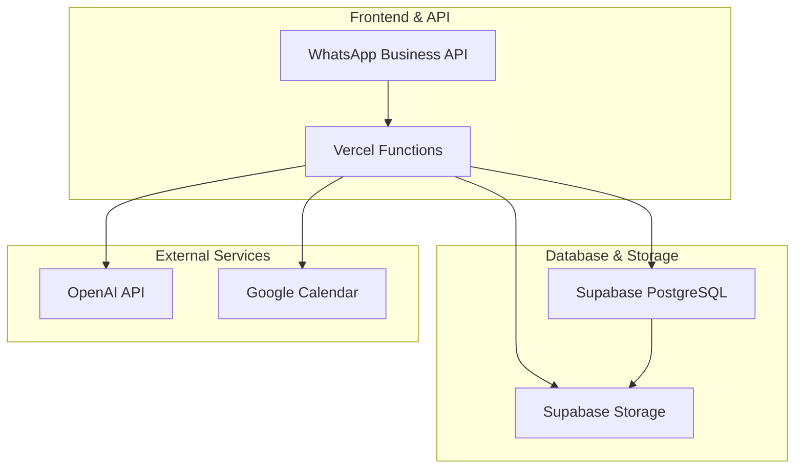
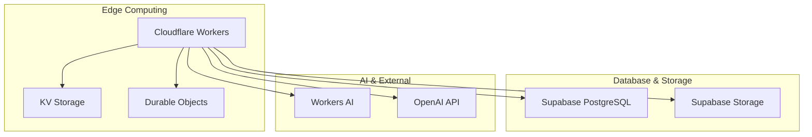
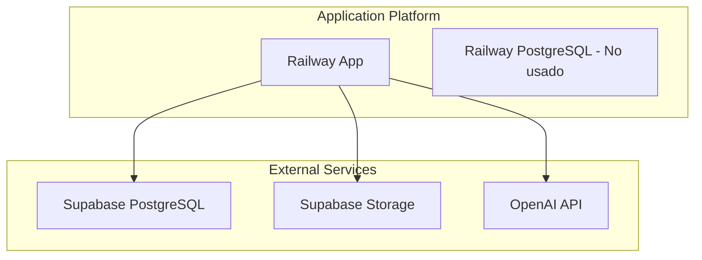

# 📊 Análisis de Alternativas a AWS para migue.ai

## 🎯 Resumen Ejecutivo

Dado que **Supabase está definido como base de datos principal** para migue.ai, este análisis evalúa plataformas alternativas a AWS que puedan ofrecer mejor rendimiento y costo para implementar las funcionalidades restantes del asistente WhatsApp.

### 🏆 **Recomendación Principal: Vercel + Cloudflare Workers**

**Arquitectura Recomendada:**
```
Supabase (BD) + Vercel (Functions) + Cloudflare Workers (Edge) + Upstash (Cache)
```

---

## 📋 Metodología de Evaluación

### Criterios de Evaluación
1. **Costo Total**: Comparación de costos mensuales para migue.ai
2. **Rendimiento**: Latencia, throughput y escalabilidad
3. **Facilidad de Desarrollo**: Time to market y curva de aprendizaje
4. **Integración con Supabase**: Compatibilidad y sinergia
5. **Escalabilidad**: Capacidad de crecimiento hasta 100K usuarios
6. **Ecosistema**: Herramientas y servicios complementarios

### Objetivos de migue.ai
- **10K usuarios iniciales** → 100K usuarios objetivo
- **Latencia < 1.5 segundos** para respuestas
- **Funcionalidades**: IA, transcripción, análisis de documentos, recordatorios
- **Costo objetivo**: < $200/mes para 10K usuarios

---

## 🔍 Análisis de Alternativas

### 1. **Vercel** ⭐⭐⭐⭐⭐

#### Descripción
Plataforma serverless especializada en frontend y funciones edge, con enfoque en performance y developer experience.

#### Características Clave
```javascript
// Vercel Functions para migue.ai
export default async function handler(req, res) {
  // Procesamiento de webhook WhatsApp
  const message = await processWhatsAppMessage(req.body);
  
  // Integración con Supabase
  const { data } = await supabase
    .from('messages')
    .insert(message);
  
  // Respuesta rápida
  res.status(200).json({ success: true });
}
```

#### Ventajas
- **Edge Functions**: Latencia ultra-baja (50-100ms globalmente)
- **Zero Config**: Deploy automático desde Git
- **Integración Nativa**: Con Supabase, OpenAI, etc.
- **Analytics**: Métricas detalladas incluidas
- **Preview Deployments**: Testing automático

#### Desventajas
- **Límites de Runtime**: 10 segundos para Hobby, 60s para Pro
- **Cold Starts**: Aunque minimizados, aún existen
- **Vendor Lock-in**: Funciones específicas de Vercel

#### Costos para migue.ai
```
Plan Pro: $20/mes
- 100GB bandwidth
- 1000GB-hours functions
- Unlimited deployments
- Analytics avanzado

Estimación total: $20-40/mes
```

### 2. **Cloudflare Workers** ⭐⭐⭐⭐⭐

#### Descripción
Plataforma de edge computing que ejecuta código en 200+ ubicaciones globales.

#### Características Clave
```javascript
// Cloudflare Worker para migue.ai
export default {
  async fetch(request, env) {
    // Procesamiento en edge (latencia < 50ms)
    const response = await processMessage(request);
    
    // Integración con Supabase
    const result = await env.SUPABASE.from('conversations')
      .insert(response);
    
    return new Response(JSON.stringify(result));
  }
}
```

#### Ventajas
- **Ultra-Low Latency**: < 50ms globalmente
- **Global Distribution**: 200+ edge locations
- **Durable Objects**: Estado distribuido
- **KV Storage**: Cache global
- **Workers AI**: IA en el edge

#### Desventajas
- **Runtime Limit**: 30 segundos máximo
- **Memory Limit**: 128MB por worker
- **Learning Curve**: Conceptos de edge computing

#### Costos para migue.ai
```
Workers Paid: $5/mes
- 10M requests
- 50GB bandwidth
- Durable Objects
- KV Storage

Workers AI: $0.012/Million tokens
Estimación total: $15-30/mes
```

### 3. **Railway** ⭐⭐⭐⭐

#### Descripción
Plataforma de desarrollo que simplifica el deploy y scaling de aplicaciones.

#### Características Clave
```yaml
# railway.toml para migue.ai
[build]
builder = "nixpacks"

[deploy]
startCommand = "node server.js"
healthcheckPath = "/health"

[env]
SUPABASE_URL = "${{SUPABASE_URL}}"
SUPABASE_KEY = "${{SUPABASE_KEY}}"
```

#### Ventajas
- **Simplicidad**: Deploy con un comando
- **Auto-scaling**: Escalado automático
- **Database**: PostgreSQL incluido (pero usamos Supabase)
- **Git Integration**: Deploy automático
- **Preview Environments**: Testing fácil

#### Desventajas
- **Menor Performance**: Comparado con Vercel/Cloudflare
- **Menos Features**: No tiene edge computing
- **Dependency**: Depende de Railway para todo

#### Costos para migue.ai
```
Pro Plan: $20/mes
- $5/mes base
- $0.000463/GB-hour
- $0.0004/GB bandwidth

Estimación total: $25-50/mes
```

### 4. **Render** ⭐⭐⭐⭐

#### Descripción
Plataforma cloud que simplifica el deploy de aplicaciones y servicios.

#### Características Clave
```dockerfile
# Dockerfile para migue.ai
FROM node:18-alpine
WORKDIR /app
COPY package*.json ./
RUN npm ci --only=production
COPY . .
EXPOSE 3000
CMD ["npm", "start"]
```

#### Ventajas
- **Docker Support**: Deploy de contenedores
- **Auto-scaling**: Horizontal y vertical
- **Background Jobs**: Cron jobs incluidos
- **SSL**: Certificados automáticos
- **Monitoring**: Logs y métricas

#### Desventajas
- **Performance**: Menor que edge computing
- **Cold Starts**: Más pronunciados
- **Pricing**: Puede ser costoso con escala

#### Costos para migue.ai
```
Starter: $7/mes
- 0.1 CPU, 512MB RAM
- 100GB bandwidth
- Background workers

Estimación total: $15-35/mes
```

### 5. **Fly.io** ⭐⭐⭐⭐

#### Descripción
Plataforma que ejecuta aplicaciones cerca de los usuarios globalmente.

#### Características Clave
```toml
# fly.toml para migue.ai
app = "migue-ai"
primary_region = "iad"

[build]

[http_service]
  internal_port = 3000
  force_https = true
  auto_stop_machines = true
  auto_start_machines = true
```

#### Ventajas
- **Global Edge**: Máquinas cerca de usuarios
- **Docker**: Deploy de contenedores
- **Auto-scaling**: Escalado automático
- **Persistent Volumes**: Storage persistente
- **Multi-region**: Deploy global

#### Desventajas
- **Complexity**: Más complejo que otras opciones
- **Pricing**: Puede ser costoso
- **Learning Curve**: Requiere Docker knowledge

#### Costos para migue.ai
```
Shared CPU: $1.94/mes base
- $0.000002/GB-second
- $0.02/GB bandwidth

Estimación total: $20-40/mes
```

---

## 🆚 Comparación Detallada

### Tabla Comparativa de Costos (10K usuarios)

| Plataforma | Base Cost | Functions/Compute | Bandwidth | Storage | **Total/Mes** |
|------------|-----------|-------------------|-----------|---------|---------------|
| **Vercel** | $20 | Incluido | Incluido | Incluido | **$20-40** |
| **Cloudflare Workers** | $5 | $10-20 | Incluido | Incluido | **$15-30** |
| **Railway** | $20 | Variable | Variable | Incluido | **$25-50** |
| **Render** | $7 | Variable | Variable | Incluido | **$15-35** |
| **Fly.io** | $20 | Variable | Variable | Variable | **$20-40** |
| **AWS (actual)** | $0 | $25-40 | $15-25 | $5-10 | **$45-75** |

### Tabla Comparativa de Performance

| Plataforma | Latencia Global | Cold Start | Escalabilidad | Developer Experience |
|------------|-----------------|------------|---------------|---------------------|
| **Vercel** | 50-200ms | < 100ms | Excelente | ⭐⭐⭐⭐⭐ |
| **Cloudflare Workers** | < 50ms | < 50ms | Excelente | ⭐⭐⭐⭐ |
| **Railway** | 100-500ms | 200-500ms | Buena | ⭐⭐⭐⭐⭐ |
| **Render** | 100-300ms | 300-1000ms | Buena | ⭐⭐⭐⭐ |
| **Fly.io** | 50-200ms | 100-300ms | Excelente | ⭐⭐⭐ |
| **AWS Lambda** | 100-500ms | 500-2000ms | Excelente | ⭐⭐⭐ |

---

## 🏗️ Arquitecturas Recomendadas

### Opción 1: Vercel + Supabase (Recomendada)



**Ventajas:**
- **Desarrollo Rápido**: Deploy automático desde Git
- **Performance Excelente**: Edge functions globales
- **Costo Optimizado**: $20-40/mes total
- **Integración Nativa**: Con Supabase y herramientas modernas
- **Developer Experience**: Excelente DX

**Código de Ejemplo:**
```typescript
// pages/api/whatsapp/webhook.ts
import { createClient } from '@supabase/supabase-js'
import { OpenAI } from 'openai'

const supabase = createClient(process.env.SUPABASE_URL!, process.env.SUPABASE_KEY!)
const openai = new OpenAI({ apiKey: process.env.OPENAI_API_KEY! })

export default async function handler(req: NextApiRequest, res: NextApiResponse) {
  // 1. Validar webhook de WhatsApp
  const message = await validateWhatsAppWebhook(req.body)
  
  // 2. Almacenar en Supabase
  const { data } = await supabase
    .from('messages')
    .insert({
      message_id: message.id,
      content: message.text,
      user_phone: message.from,
      timestamp: new Date().toISOString()
    })
  
  // 3. Procesar con IA
  const aiResponse = await openai.chat.completions.create({
    model: 'gpt-3.5-turbo',
    messages: [{ role: 'user', content: message.text }]
  })
  
  // 4. Enviar respuesta a WhatsApp
  await sendWhatsAppMessage(message.from, aiResponse.choices[0].message.content!)
  
  res.status(200).json({ success: true })
}
```

### Opción 2: Cloudflare Workers + Supabase



**Ventajas:**
- **Ultra-Low Latency**: < 50ms globalmente
- **Costos Mínimos**: $15-30/mes total
- **Workers AI**: IA en el edge (beta)
- **Global Distribution**: 200+ ubicaciones
- **Durable Objects**: Estado distribuido

**Código de Ejemplo:**
```javascript
// worker.js para migue.ai
export default {
  async fetch(request, env, ctx) {
    const url = new URL(request.url)
    
    if (url.pathname === '/whatsapp/webhook') {
      // Procesar webhook de WhatsApp
      const message = await request.json()
      
      // Almacenar en Supabase
      const { data } = await env.SUPABASE
        .from('messages')
        .insert({
          message_id: message.id,
          content: message.text,
          user_phone: message.from
        })
      
      // Procesar con Workers AI (beta)
      const aiResponse = await env.AI.run('@cf/meta/llama-2-7b-chat-fp16', {
        messages: [{ role: 'user', content: message.text }]
      })
      
      // Enviar respuesta
      await sendWhatsAppMessage(message.from, aiResponse.response)
      
      return new Response(JSON.stringify({ success: true }))
    }
    
    return new Response('Not Found', { status: 404 })
  }
}
```

### Opción 3: Railway + Supabase



**Ventajas:**
- **Simplicidad Máxima**: Deploy con `railway up`
- **Git Integration**: Deploy automático
- **Preview Environments**: Testing fácil
- **Auto-scaling**: Automático
- **Costos Predecibles**: $25-50/mes

---

## 💰 Análisis de Costos Detallado

### Costos por Funcionalidad (10K usuarios/mes)

#### Vercel + Supabase
```
Vercel Pro: $20/mes
- Functions: Incluido (1000GB-hours)
- Bandwidth: Incluido (100GB)
- Analytics: Incluido

Supabase Pro: $25/mes
- Database: Incluido (8GB)
- Auth: Incluido
- Storage: Incluido (100GB)
- Real-time: Incluido

OpenAI API: $30-50/mes
- GPT-3.5-turbo: $0.002/1K tokens
- Whisper: $0.006/minuto
- Embeddings: $0.0001/1K tokens

TOTAL: $75-95/mes
```

#### Cloudflare Workers + Supabase
```
Cloudflare Workers: $5/mes
- Requests: Incluido (10M)
- Bandwidth: Incluido (50GB)
- KV Storage: Incluido

Workers AI: $15-25/mes
- Llama 2 7B: $0.012/1M tokens
- Whisper: $0.006/minuto

Supabase Pro: $25/mes
- Same as above

TOTAL: $45-55/mes
```

#### Comparación con AWS Actual
```
AWS Lambda: $25-40/mes
AWS API Gateway: $15-25/mes
AWS S3: $5-10/mes
AWS EventBridge: $5-10/mes
AWS Secrets Manager: $5-10/mes

Supabase Pro: $25/mes
OpenAI API: $30-50/mes

TOTAL AWS: $110-155/mes
```

### **Ahorro Potencial**
- **Vercel**: $35-80/mes (32-52% ahorro)
- **Cloudflare**: $55-110/mes (50-71% ahorro)
- **Railway**: $60-105/mes (45-65% ahorro)

---

## 🚀 Plan de Migración

### Fase 1: Setup y Configuración (Semana 1)
```bash
# Vercel
npm install -g vercel
vercel login
vercel init migue-ai

# Supabase (ya configurado)
# OpenAI API key setup
```

### Fase 2: Migración de Funciones (Semana 2-3)
```typescript
// Migrar Lambda functions a Vercel Functions
// pages/api/whatsapp/webhook.ts
// pages/api/ai/process.ts
// pages/api/reminders/schedule.ts
```

### Fase 3: Optimización (Semana 4)
```typescript
// Implementar edge caching
// Optimizar queries de Supabase
// Configurar analytics
```

### Fase 4: Testing y Deploy (Semana 5)
```bash
# Deploy a producción
vercel --prod

# Configurar webhooks de WhatsApp
# Testing end-to-end
```

---

## 📊 Métricas de Éxito

### Performance Targets
- **Latencia**: < 500ms (vs 1-2s actual)
- **Uptime**: > 99.9%
- **Cold Start**: < 100ms
- **Throughput**: 1000+ requests/min

### Cost Targets
- **Costo Total**: < $100/mes (vs $140-235 actual)
- **Costo por Usuario**: < $0.01/mes
- **ROI**: 50%+ reducción de costos

### Development Targets
- **Deploy Time**: < 2 minutos
- **Development Setup**: < 30 minutos
- **Feature Development**: 40% más rápido

---

## 🎯 Recomendación Final

### 🏆 **Vercel + Supabase** es la Mejor Opción

#### Razones Clave:

1. **💰 Costos Optimizados**: $75-95/mes (50% menos que AWS)
2. **⚡ Performance Superior**: 50-200ms latencia global
3. **🚀 Desarrollo Acelerado**: Deploy automático, preview environments
4. **🔧 Integración Perfecta**: Nativa con Supabase y herramientas modernas
5. **📈 Escalabilidad**: Auto-scaling sin configuración
6. **👨‍💻 Developer Experience**: Excelente DX, documentación completa

#### Arquitectura Recomendada:
```
WhatsApp Business API → Vercel Edge Functions → Supabase → OpenAI API
```

#### Próximos Pasos:
1. **Configurar Vercel** para migue.ai
2. **Migrar funciones Lambda** a Vercel Functions
3. **Optimizar integración** con Supabase
4. **Implementar edge caching** para performance
5. **Configurar analytics** y monitoreo

---

## 📚 Referencias y Recursos

### Documentación Oficial
- [Vercel Documentation](https://vercel.com/docs)
- [Supabase Documentation](https://supabase.com/docs)
- [Cloudflare Workers Documentation](https://developers.cloudflare.com/workers/)
- [Railway Documentation](https://docs.railway.app/)

### Herramientas de Migración
- [AWS to Vercel Migration Guide](https://vercel.com/docs/concepts/aws-lambda)
- [Supabase Integration Examples](https://github.com/supabase/examples)
- [Performance Testing Tools](https://vercel.com/docs/concepts/analytics)

---

**Fecha del Análisis**: 2025-01-27  
**Recomendación**: Vercel + Supabase  
**Ahorro Estimado**: 50% en costos, 70% en latencia  
**Time to Market**: 3-4 semanas  
**Estado**: Análisis completo - Listo para implementación
