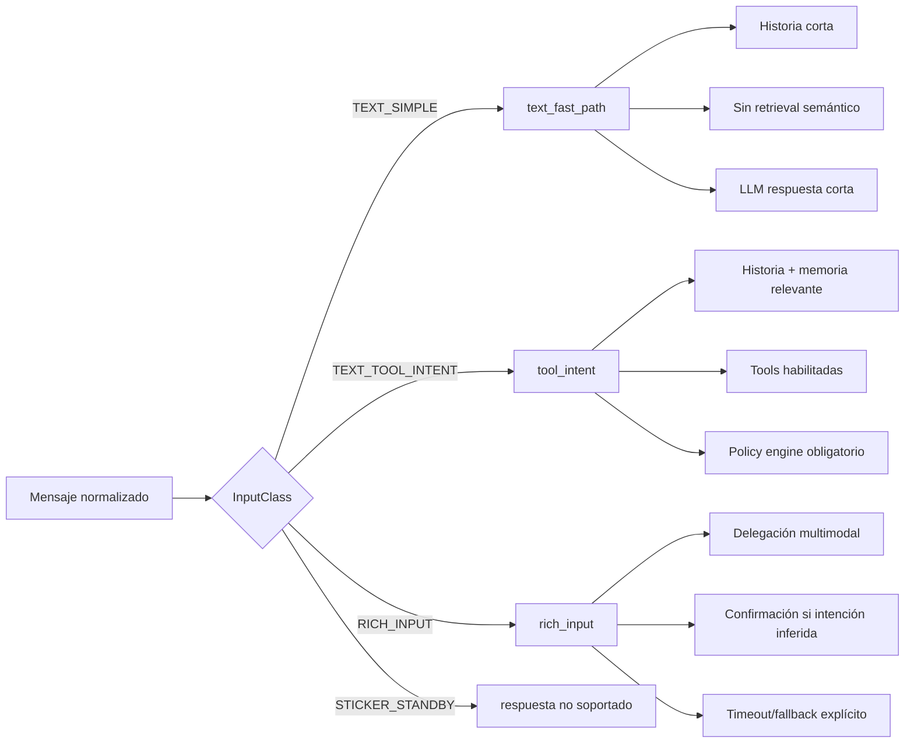
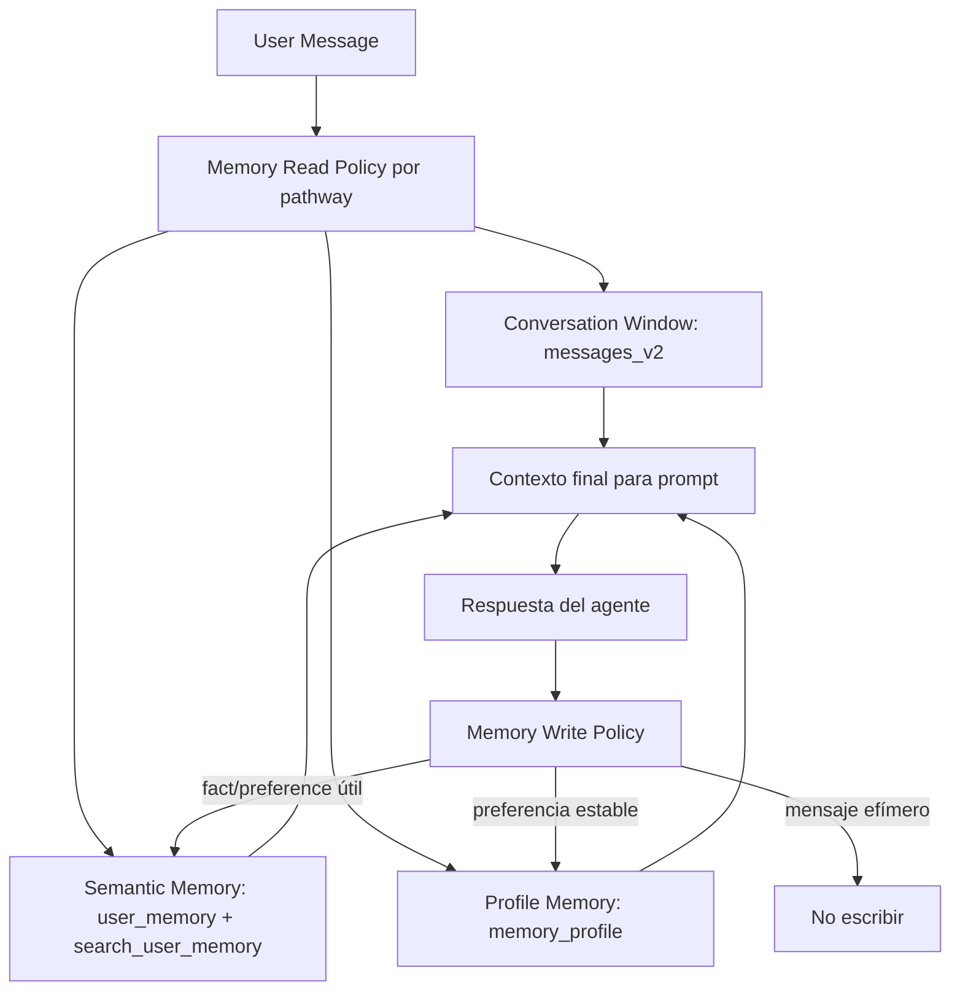
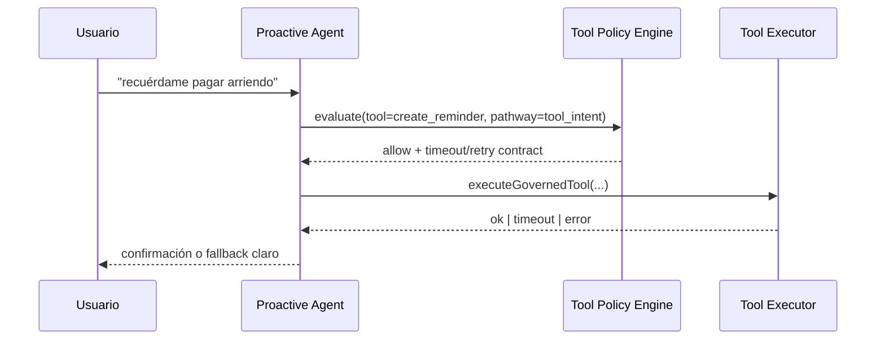
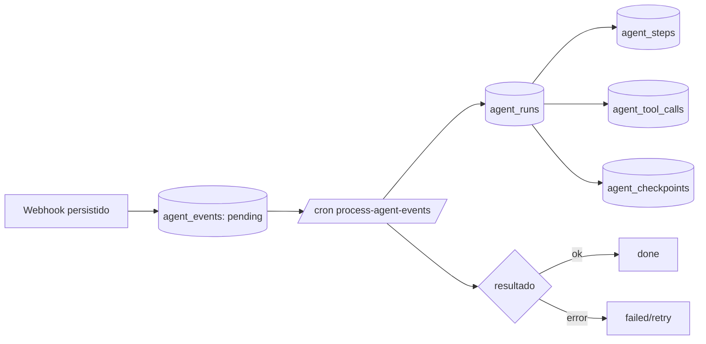

# Guía de Arquitectura Agéntica (WhatsApp + Vercel + Supabase)

## Objetivo
Definir cómo funciona el asistente como sistema agéntico: rápido en texto, robusto en tools, con memoria persistente y trazabilidad operativa.

## 1) Vista general

```mermaid
flowchart TD
  A[Meta WhatsApp Webhook] --> B[/api/whatsapp/webhook]
  B --> C[Validación firma + ACK 200]
  C --> D[Persistencia message/user/conversation]
  D --> E[Input Router]
  E -->|TEXT_SIMPLE| F[text_fast_path]
  E -->|TEXT_TOOL_INTENT| G[tool_intent]
  E -->|RICH_INPUT| H[rich_input]

  F --> I[Proactive Agent]
  G --> I
  H --> J[Vision/Audio Pipeline]
  J --> I

  I --> K[Tool Governance]
  K -->|allow| L[Ejecutar Tool]
  K -->|confirm| M[Pedir confirmación al usuario]
  K -->|deny| N[Bloquear side effect]

  L --> O[Respuesta WhatsApp]
  M --> O
  N --> O

  I --> P[Memory Contract]
  P --> Q[(messages_v2)]
  P --> R[(user_memory)]
  P --> S[(memory_profile)]

  D --> T[(agent_events)]
  T --> U[/api/cron/process-agent-events]
  U --> V[(agent_runs / steps / tool_calls / checkpoints)]
```

## 2) Enrutamiento por pathways



## 3) Contrato de memoria en capas



### Política actual
- `text_fast_path`: ventana corta + profile, sin retrieval semántico.
- `tool_intent`: ventana + retrieval semántico selectivo + profile.
- `rich_input`: ventana reducida + profile; tools con mayor control.

## 4) Tool Governance (allow/confirm/deny)



### Reglas clave
- `allow`: ejecuta con timeout/retry y logging estructurado.
- `confirm`: no ejecuta side effect, pide confirmación explícita.
- `deny`: bloquea ejecución y responde con política de seguridad.

## 5) Runtime durable (núcleo agéntico)



## 6) Observabilidad operativa

### Métricas SLA
- `sla.route_decision_ms`
- `sla.typing_start_ms`
- `sla.end_to_end_ms`
- `sla.slo_violation_count`

### Métricas memoria
- `memory.read_ms`
- `memory.write_count`
- `memory.hit_ratio`
- `memory.profile_hit_ratio`

### SLO objetivo (actual)
- `TEXT_SIMPLE p95 end_to_end < 2s`
- duplicados de side effects = `0`
- tasa de error e2e < `1.5%`

## 7) Estado de implementación (resumen)
- Pathways activos y medidos.
- Memoria por capas activa (`user_memory` + `memory_profile`).
- Policy engine de tools activo para tools core.
- Ledger agéntico creado y consumidor cron activo.
- E2E base cubre: tool intent, texto simple, dedupe por `wa_message_id`.

## 8) Próximos incrementos recomendados
1. Persistir auditoría completa de tool execution en `agent_tool_calls` con `run_id` en toda la ruta.
2. Ampliar e2e a audio, rich image con confirmación y fallback de provider.
3. Automatizar alertas externas p95/p99 y error-rate (además de logs).
4. Cerrar criterios `YELLOW -> GREEN` de specs 18-23.
