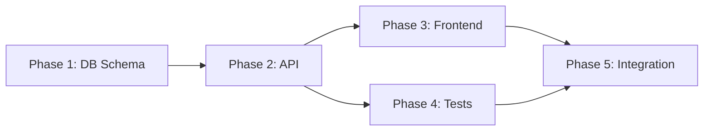

# Phase-Based Development Methodology

Comprehensive guide to breaking complex projects into manageable, checkpoint-sized phases optimized for Claude's context cycle.

## Overview

Phase-based development aligns software development with Claude Code's operational constraints:

- **5-hour context cycle**: Claude's context window resets approximately every 5 hours
- **Token limits**: ~200K tokens maximum context
- **Checkpoint cadence**: Save state every 30 minutes to prevent work loss
- **Phase size**: 2-4 hours of focused work per phase

## Core Principles

### 1. Context-Aligned Phases

```
5-Hour Context Cycle
├─ Phase 1 (2-4h): Feature A
│  ├─ Checkpoint @ 30min
│  ├─ Checkpoint @ 1h
│  ├─ Checkpoint @ 1.5h
│  └─ Complete & Document
├─ Phase 2 (2-4h): Feature B
└─ Context Reset → Continue with fresh context
```

**Benefits**:
- Prevents work loss from context resets
- Natural breaking points for review
- Reduced cognitive load
- Better progress tracking

### 2. Small Subtasks

Each phase consists of subtasks with <200 line diffs:

```
Phase: User Authentication
├─ Subtask 1: Database schema (<200 lines)
├─ Subtask 2: API endpoints (<200 lines)
├─ Subtask 3: Frontend form (<200 lines)
└─ Subtask 4: Tests (<200 lines)
```

**Benefits**:
- Easier to review
- Less merge conflicts
- Faster iterations
- Clear progress indicators

### 3. Checkpoint-Driven Execution

Save state regularly to enable recovery:

```
Every 30 Minutes:
1. Save TodoWrite state
2. Commit code changes
3. Update documentation
4. Log progress

Every 2-4 Hours (End of Phase):
1. Complete phase checklist
2. Update project status
3. Document decisions
4. Prepare next phase
```

## Phase Structure

### Phase Anatomy

```markdown
# Phase: [Phase Name]

## Objective
Clear, measurable goal for this phase

## Duration
Estimated: 2-4 hours

## Prerequisites
- Previous phase completed
- Dependencies available
- Resources allocated

## Subtasks
1. [ ] Subtask 1 (<200 line diff)
2. [ ] Subtask 2 (<200 line diff)
3. [ ] Subtask 3 (<200 line diff)

## Acceptance Criteria
- [ ] All tests pass
- [ ] Code reviewed
- [ ] Documentation updated
- [ ] Performance acceptable

## Deliverables
- Feature X implemented
- Tests added
- Documentation updated

## Next Phase
Phase Y: [Brief description]
```

### Phase Types

#### 1. Planning Phase

**Duration**: 1-2 hours
**Focus**: Architecture, design, requirements

**Typical Activities**:
- Analyze requirements
- Create architecture diagrams
- Design database schema
- Plan API endpoints
- Estimate complexity

**Deliverables**:
- Architecture documentation
- Technical design document
- Task breakdown
- Risk assessment

#### 2. Implementation Phase

**Duration**: 2-4 hours
**Focus**: Writing code, building features

**Typical Activities**:
- Write tests (TDD)
- Implement core logic
- Create UI components
- Integrate APIs
- Handle edge cases

**Deliverables**:
- Working code
- Passing tests
- Code comments
- Basic documentation

#### 3. Quality Phase

**Duration**: 1-2 hours
**Focus**: Testing, review, optimization

**Typical Activities**:
- Code review
- Security audit
- Performance testing
- Integration testing
- Documentation review

**Deliverables**:
- Quality report
- Fixed issues
- Optimization results
- Updated documentation

#### 4. Integration Phase

**Duration**: 2-3 hours
**Focus**: Combining components, end-to-end testing

**Typical Activities**:
- Merge feature branches
- Integration testing
- Deployment preparation
- Documentation finalization
- Handoff preparation

**Deliverables**:
- Integrated system
- E2E tests passing
- Deployment guide
- Release notes

## Planning Workflow

### 1. Project Decomposition

```
Large Project
├─ Epic 1: User Management
│  ├─ Feature 1.1: Registration
│  │  ├─ Phase 1.1.1: Backend API (3h)
│  │  ├─ Phase 1.1.2: Frontend UI (3h)
│  │  └─ Phase 1.1.3: Testing & QA (2h)
│  └─ Feature 1.2: Authentication
│     ├─ Phase 1.2.1: JWT Implementation (3h)
│     └─ Phase 1.2.2: Integration (2h)
└─ Epic 2: Product Catalog
   └─ ...
```

### 2. Phase Dependencies



**Dependency Rules**:
- Sequential: A → B (B depends on A)
- Parallel: A, B (independent, can run simultaneously)
- Blocking: A must complete before B starts

### 3. Resource Allocation

```
Phase Planning:
├─ Time: 2-4 hours
├─ Context: <80% usage target
├─ Agents: Primary + fallback
└─ Checkpoints: Every 30min

Example:
Phase: Payment Integration
├─ Time: 3 hours
├─ Context: Target <60% (leave buffer)
├─ Primary Agent: api-integration-specialist
├─ Fallback Agent: backend-developer
└─ Checkpoints: 0:30, 1:00, 1:30, 2:00, 2:30, 3:00
```

## Execution Protocol

### Phase Start

```markdown
1. **Read Context**
   - Previous phase summary
   - Current phase objectives
   - Available resources

2. **Create TodoWrite**
   - List all subtasks
   - Estimate complexity
   - Identify dependencies

3. **Set Checkpoints**
   - Every 30 minutes
   - Before context operations
   - After major milestones

4. **Begin Work**
   - Start with smallest task
   - Update todos continuously
   - Monitor context usage
```

### During Phase

```markdown
Every 30 Minutes:
1. **Save State**
   - Commit code changes
   - Update TodoWrite
   - Log progress

2. **Check Context**
   - Run /context command
   - If >60%: Consider /compact
   - If >80%: Checkpoint & /clear

3. **Validate Progress**
   - Are subtasks completing as planned?
   - Any blockers encountered?
   - Need to adjust approach?

4. **Update Documentation**
   - Code comments
   - README updates
   - Decision log
```

### Phase End

```markdown
1. **Validate Completion**
   - [ ] All subtasks done
   - [ ] Tests passing
   - [ ] Code reviewed
   - [ ] Documentation updated

2. **Create Checkpoint**
   - Final code commit
   - Update project status
   - Document decisions
   - Log metrics

3. **Prepare Handoff**
   - Summary of completed work
   - Known issues/limitations
   - Next steps
   - Context for next phase

4. **Clean Up**
   - Archive temporary files
   - Organize documentation
   - Update CLAUDE.md
```

## Context Management

### Token Budget Per Phase

```
Typical 3-Hour Phase Token Usage:
├─ System Prompts: ~5K tokens (3%)
├─ Phase Documentation: ~10K tokens (6%)
├─ Code Context: ~30K tokens (18%)
├─ Conversation: ~40K tokens (24%)
├─ Agent Responses: ~30K tokens (18%)
└─ Available Buffer: ~85K tokens (51%)

Target: Stay under 120K tokens (60% of 200K)
```

### Context Optimization Strategies

#### Load Documentation On-Demand

```bash
# ❌ Bad - Load everything upfront
Read all docs at phase start → Wastes ~50K tokens

# ✅ Good - Load as needed
Read docs when referenced → Saves ~40K tokens
```

#### External Reference Pattern

```bash
# ❌ Bad - Embed full specs
System prompt includes entire API spec (10K tokens)

# ✅ Good - Reference external docs
"See docs/api-spec.md for endpoint details" (10 tokens)
```

#### Progressive Context Loading

```
Phase Start (Minimal):
├─ Phase objectives (500 tokens)
├─ Previous phase summary (1K tokens)
└─ Subtask list (500 tokens)

As Needed (On-Demand):
├─ Detailed specs when implementing
├─ Related code when editing
└─ Documentation when updating
```

## Quality Gates

### Phase Completion Checklist

```markdown
Before marking phase complete:

Technical:
- [ ] All code compiles/runs
- [ ] Tests pass (coverage >80%)
- [ ] No linting errors
- [ ] Performance acceptable

Quality:
- [ ] Code reviewed
- [ ] Security validated
- [ ] Best practices followed
- [ ] Error handling complete

Documentation:
- [ ] Code comments added
- [ ] README updated
- [ ] API docs current
- [ ] Changelog updated

Handoff:
- [ ] Work committed/pushed
- [ ] Metrics recorded
- [ ] Next phase planned
- [ ] Context prepared
```

### Acceptance Criteria

Each phase should define clear acceptance criteria:

```markdown
Phase: User Registration

Acceptance Criteria:
- [ ] User can register with email/password
- [ ] Email validation works
- [ ] Password meets security requirements
- [ ] Duplicate email rejected
- [ ] Confirmation email sent
- [ ] Registration tracked in analytics
```

## Example Phases

### Example 1: API Development Phase

```markdown
# Phase: REST API for User Management

## Objective
Create REST API endpoints for user CRUD operations

## Duration
3 hours

## Subtasks
1. [ ] Design API endpoints (<200 lines schema)
2. [ ] Implement GET /users endpoint (<200 lines)
3. [ ] Implement POST /users endpoint (<200 lines)
4. [ ] Implement PUT /users/:id endpoint (<200 lines)
5. [ ] Implement DELETE /users/:id endpoint (<200 lines)
6. [ ] Add input validation (<200 lines)
7. [ ] Write unit tests (<200 lines per endpoint)
8. [ ] Update API documentation

## Checkpoints
- 0:30 - Endpoint design complete
- 1:00 - GET implemented and tested
- 1:30 - POST implemented and tested
- 2:00 - PUT implemented and tested
- 2:30 - DELETE implemented and tested
- 3:00 - All tests passing, docs updated

## Acceptance Criteria
- [ ] All CRUD operations work
- [ ] Input validation prevents bad data
- [ ] Tests cover happy path + edge cases
- [ ] OpenAPI docs updated
- [ ] Postman collection created

## Delegation
- API Design: api-designer (30min)
- Implementation: typescript-pro (2h)
- Testing: test-engineer (30min)
- Documentation: api-documenter (30min)
```

### Example 2: Frontend Component Phase

```markdown
# Phase: User Dashboard Component

## Objective
Build responsive user dashboard with data visualization

## Duration
4 hours

## Subtasks
1. [ ] Design component structure (<200 lines)
2. [ ] Implement layout component (<200 lines)
3. [ ] Add data fetching logic (<200 lines)
4. [ ] Create chart components (<200 lines)
5. [ ] Add responsive styling (<200 lines)
6. [ ] Implement loading states (<200 lines)
7. [ ] Add error handling (<200 lines)
8. [ ] Write component tests (<200 lines)

## Checkpoints
- 0:30 - Component structure designed
- 1:00 - Layout implemented
- 1:30 - Data fetching working
- 2:00 - Charts rendering
- 2:30 - Responsive styling complete
- 3:00 - Loading/error states done
- 3:30 - Tests written
- 4:00 - All tests passing

## Acceptance Criteria
- [ ] Dashboard displays user data
- [ ] Charts visualize data correctly
- [ ] Responsive on mobile/tablet/desktop
- [ ] Loading states show during fetch
- [ ] Errors handled gracefully
- [ ] Tests cover all scenarios

## Delegation
- Design: ui-ux-designer (1h)
- Implementation: frontend-developer (2h)
- Testing: test-engineer (1h)
```

## Metrics & Tracking

### Phase Metrics

Track these metrics for each phase:

```markdown
Phase Metrics:
- Planned Duration: 3h
- Actual Duration: 3.5h
- Subtasks Planned: 8
- Subtasks Completed: 8
- Blocked Tasks: 0
- Context Usage Peak: 65%
- Checkpoints Created: 7
- Issues Found: 2
- Issues Resolved: 2
```

### Project-Level Metrics

```markdown
Project Metrics:
- Total Phases: 12
- Completed Phases: 8
- In Progress: 1
- Blocked: 0
- Average Phase Duration: 3.2h
- On Schedule: Yes
- Quality Gates Passed: 8/8
```

## Troubleshooting

### Phase Running Long

**Problem**: Phase taking longer than planned

**Solutions**:
1. Break into smaller subtasks
2. Delegate more aggressively
3. Defer non-critical items to next phase
4. Use parallel execution where possible

### Context Usage High

**Problem**: Approaching 80% context usage

**Solutions**:
1. Checkpoint current state
2. Run /compact to reduce context
3. Clear non-essential conversation
4. Continue with fresh context

### Blocked on Dependencies

**Problem**: Cannot proceed without external dependency

**Solutions**:
1. Mark phase as blocked
2. Work on independent tasks
3. Document blocker
4. Escalate if needed
5. Move to different phase

## Best Practices

- ✅ Keep phases between 2-4 hours
- ✅ Break subtasks to <200 line diffs
- ✅ Checkpoint every 30 minutes
- ✅ Monitor context usage continuously
- ✅ Use TodoWrite for transparency
- ✅ Document decisions as you go
- ✅ Validate quality before completing phase
- ✅ Prepare clear handoff to next phase

## Related Documentation

- [Orchestration README](./README.md) - Overall methodology
- [Delegation Matrix](./delegation-matrix.md) - Agent routing guide
- [Subagents Guide](../subagents/README.md) - Agent configuration
- [Best Practices](../subagents/best-practices.md) - Optimization strategies

---

**Last Updated**: 2025-10-15
**Version**: 1.0.0
**Maintained by**: Project Orchestration Team
